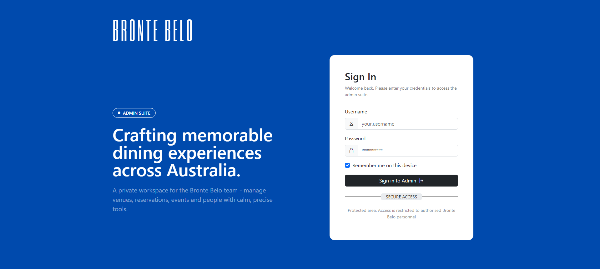
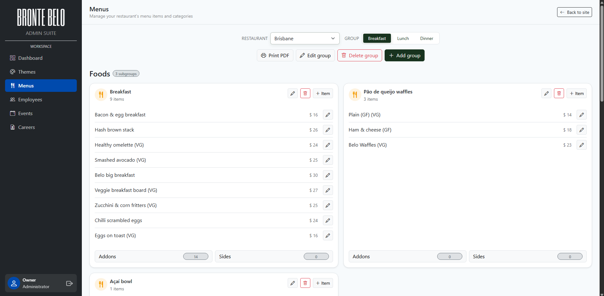
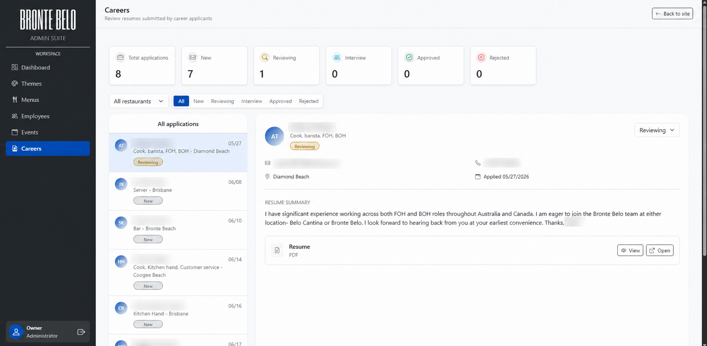
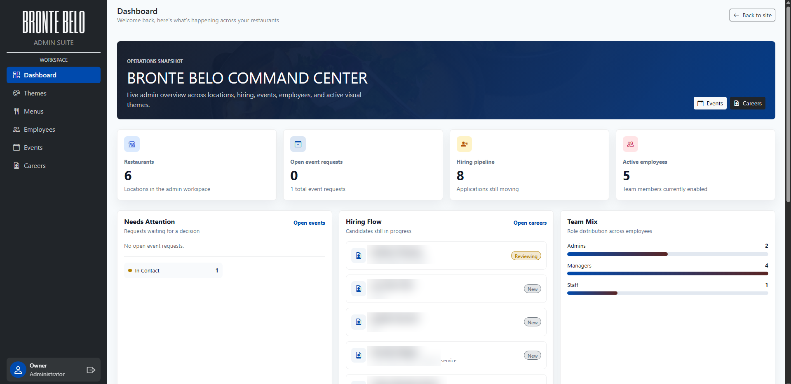

# Bronte Belo

## Visão geral

O **Bronte Belo** é um projeto real desenvolvido para um restaurante localizado na Austrália, com foco em presença digital, divulgação institucional e gerenciamento de conteúdo.

O site está publicado em ambiente real e funciona como uma vitrine online do restaurante, permitindo que clientes, turistas e pessoas interessadas em visitar a Austrália encontrem informações sobre o estabelecimento, cardápio, eventos e identidade visual do negócio.

Além da área pública, o projeto conta com uma área administrativa para facilitar a atualização de conteúdos internos, tornando a solução útil não apenas como apresentação visual, mas também como ferramenta de apoio à operação do restaurante.

---

## Objetivo

Criar uma presença online profissional para o restaurante **Bronte Belo**, permitindo que visitantes encontrem rapidamente informações importantes sobre o estabelecimento e que a equipe consiga gerenciar conteúdos do site de forma prática.

O projeto foi pensado para unir apresentação visual, navegação simples e autonomia administrativa, reduzindo a dependência de alterações manuais no código para conteúdos como cardápio, eventos, identidade visual e informações institucionais.

---

## Principais funcionalidades

- Site institucional publicado em produção
- Exibição de informações do restaurante
- Apresentação de cardápio
- Divulgação de eventos
- Área administrativa para gerenciamento de conteúdo
- Visualização de currículos enviados externamente
- Edição de cardápio pela administração
- Edição de eventos
- Gerenciamento de colaboradores e permissões internas
- Ajustes visuais, como cores associadas à identidade do restaurante
- Estrutura voltada para visitantes nacionais e internacionais

---

## Interface administrativa

A área administrativa foi criada para dar autonomia à equipe do restaurante na manutenção do conteúdo do site.

Por meio do painel interno, a staff consegue acompanhar informações operacionais, gerenciar cardápios, revisar currículos, controlar eventos e ajustar elementos visuais da interface sem depender de alterações manuais no código.

> As imagens abaixo preservam a aparência real da interface. Apenas nomes de pessoas foram borrados nos prints que exibem candidatos reais.

### Acesso restrito da administração

### Gerenciamento de cardápio

### Gestão de currículos

### Painel administrativo

---

## Impacto do projeto

O Bronte Belo não é apenas um projeto demonstrativo. Ele é uma solução real utilizada por um restaurante em funcionamento na Austrália.

Por estar publicado online, o site também atende pessoas de diferentes países que pesquisam pelo restaurante antes de viajar ou visitar a região. Isso transforma o projeto em uma entrega com uso real, exposição pública e responsabilidade prática sobre a experiência do usuário.

Além da presença pública, a existência de uma área administrativa reforça o caráter funcional da solução, já que o projeto também apoia a operação interna do restaurante e facilita a atualização contínua das informações exibidas ao público.

---

## Entregas

- Site publicado e acessível online
- Interface visual organizada
- Navegação simples para o usuário final
- Estrutura institucional para divulgação do restaurante
- Área administrativa para manutenção de conteúdos
- Sistema de gerenciamento de cardápio e eventos
- Apoio à operação do restaurante por meio de recursos internos
- Fluxo administrativo para acompanhamento de currículos
- Painel interno com visão geral de informações importantes

---

## Competências demonstradas

- Desenvolvimento de aplicação web real
- Publicação de projeto em produção
- Organização de interface
- Estruturação de páginas institucionais
- Criação de área administrativa
- Gerenciamento de conteúdo
- Desenvolvimento de painel interno
- Experiência voltada para o usuário final
- Responsividade e navegação acessível
- Cuidado com privacidade e exposição de dados
- Entrega de produto funcional para cliente real

---

## Link do projeto

🌐 [Acessar o site oficial do Bronte Belo](https://brontebelorestaurants.com.au)
